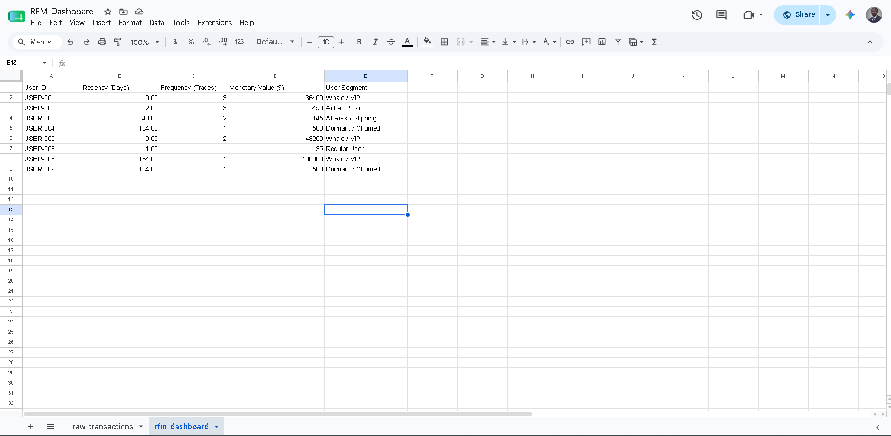
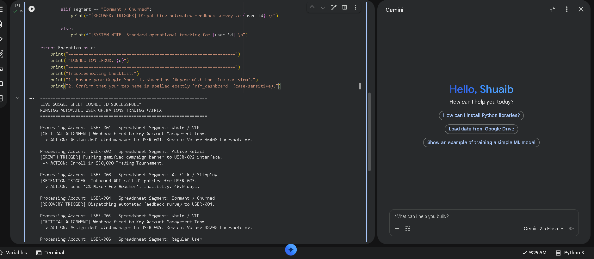

# Crypto Platform User Operations: Programmatic RFM Segmentation Engine

## Project Overview
This repository contains an end-to-end user growth and lifecycle operations framework designed for global cryptocurrency exchanges. The system processes raw trading telemetry to calculate real-time **Recency, Frequency, and Monetary (RFM)** metrics, groups users into distinct behavioral cohorts, and programmatically routes them into dedicated automated retention pathways.

By connecting data-driven insights directly to automated execution scripts, this architecture eliminates manual list management, mitigates user churn, and scales platform operations without increasing headcount.

---

## Core System Architecture
The system operates across three distinct operational layers:
1. **Data Schema (`schema.sql`)**: A highly optimized relational database design structured to handle high-frequency order book and transaction logs.
2. **Spreadsheet Prototype**: A dynamic data sandbox modeling raw account analytics into user segments using native mathematical array logic (`MAXIFS`, `COUNTIFS`, `SUMIFS`).
3. **Execution Engine (`automation_engine.py`)**: A production-ready Python backend script that establishes a live API pipeline to read the data layers and dispatch programmatic outreach actions.

---

## System Proof of Work

### 1. Live Google Sheets RFM Dashboard Prototype
* **Live Interactive Sandbox**: [View Live Google Sheets Dashboard](https://docs.google.com/spreadsheets/d/1J1rPswzfrRnqjq5ySNfqqzxGr90PgoCYh4GTq-CzG_Y)

The dashboard processes raw transaction parameters and dynamically outputs real-time user lifecycle categories:


### 2. Live Python Automation Engine Execution Output
The Python pipeline connects directly to the spreadsheet API, reading rows in real-time, matching states, and executing growth campaigns:


---

## Programmatic Operational Matrix & Playbooks

The automation engine routes accounts based on the following pre-defined business logic thresholds:

| User Segment | Criteria Matrix | Automated Operational Action | Campaign Intent |
| :--- | :--- | :--- | :--- |
| **Whale / VIP** | High volume, low recency | Fires direct Webhook to Key Account Management (KAM) channels | Manual, high-touch premium onboarding & dedicated node provisioning |
| **Active Retail** | High frequency, small balances | Dispatches in-app notification engine payload | Automated enrollment in active trading tournaments & high-yield staking promos |
| **At-Risk / Slipping** | Elevated recency window | Dispatches outbound marketing service API call | Triggers a custom '0% Maker Fee Voucher' valid for 72h to intercept churn |
| **Dormant / Churned** | Maximum recency breached | Executes an automated email survey sequence | Low-overhead customer feedback collection to identify product drop-off friction |

---

## How to Run the Project Locally

### Technical Prerequisites
Ensure you have the Python data analysis library installed:
```bash
pip install pandas
